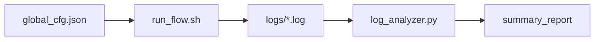
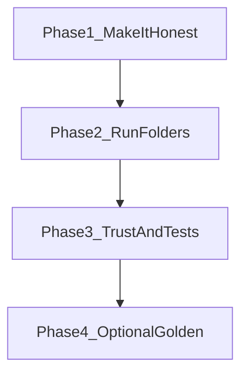

# EDA Flow Simulator — Project Plan

A beginner-friendly roadmap for finishing this repo. Budget: **~2 hours per week**. Goal: a **small, CV-worthy** project — not a year-long build.

---

## What this project is (plain English)

Think of a factory assembly line for a chip design:

1. **Run steps** — compile → elaboration → synthesis → timing check (`scripts/run_flow.sh` fakes this today).
2. **Each step writes a diary** — the `.log` files in `logs/`.
3. **Someone reads the diaries** — `src/log_analyzer.py` pulls out numbers (gate count, timing slack).
4. **Someone writes a one-page summary** — `summary_report.md` and `summary_report.html`.

That glue work — configs, running steps, parsing logs, generating reports — is what **CAD / flow automation** teams do in chip companies. This project practices that mindset at a small scale.



---

## Glossary

| Term | Plain meaning |
|------|----------------|
| **EDA** | Software tools used to design chips (synthesis, timing analysis, etc.). |
| **Flow** | Ordered list of tool steps you run on a design. |
| **Stage** | One step in the flow (e.g. synthesis). |
| **Log** | Text file a tool prints while it runs. |
| **WNS** | Worst Negative Slack — how much timing margin is left. **Negative = too slow, fails timing.** |
| **Gate count** | Roughly how big the logic is after synthesis. |
| **STA** | Static Timing Analysis — checks if the design meets speed targets. |
| **Critical stage** | If this fails, stop the whole flow (don't waste time on later steps). |
| **Regression** | Run again and compare to last time: did things get worse? |
| **Golden** | Saved "good" metrics you compare against on the next run. |
| **Config** | One JSON file that says what to run and how strict to be. |
| **QoR** | Quality of Results — timing, area, power type metrics. |

---

## Current state

### What works today

- `scripts/run_flow.sh` runs four stages and writes fake tool logs from `templates/fake_synth.log`.
- `src/log_analyzer.py` parses logs and builds Markdown + HTML reports.
- `src/report_generator.py` formats the reports.
- `config/global_cfg.json` defines stages, MHz, critical flags, and error chances.
- `tests/test_log_analyzer.py` has pytest coverage for parsing and analysis.
- Virtual environment lives at `.venv` (not `venv`).

### Known gaps (fix these in Phase 1)

| Gap | Where | What to fix |
|-----|-------|-------------|
| Config not driving the runner | `scripts/run_flow.sh` | Stages and `FREQ=800` are hardcoded; `error_chance_percentage` in JSON is unused. |
| Duplicate parsing logic | `src/log_analyzer.py` | `parse_log()` exists but `analyze_logs()` reimplements the same regexes in a loop. |
| Config loaded but unused | `src/log_analyzer.py` | `load_config()` runs in `__main__` but `analyze_logs()` never uses the config. |
| Report written inside loop | `src/log_analyzer.py` | `generate_markdown_report()` is called on every log file instead of once at the end. |
| README outdated | `README.md` | References `config.json`, `./run_flow.sh`, `fake_logs/` — real paths differ. |

---

## Scope constraint

- **In scope:** config-driven flow, clean parser, run folders, tests, honest README.
- **Out of scope (for now):** real EDA tools, job schedulers (LSF/Slurm), Kubernetes, multi-tool log formats, web dashboards.

Stop after Phase 3 unless you still have time and interest. Phase 4 is optional polish.

---

## Phased tasks



### Phase 1 — Make it honest (3–4 sessions)

**Goal:** The config file actually controls the flow; the analyzer has one clean parse path.

- [x] `run_flow.sh` reads stages, `target_frequency_mhz`, and `error_chance_percentage` from `config/global_cfg.json` (use `jq` in bash, or rewrite the runner in Python).
- [x] Respect `critical` flag: halt on failure for critical stages; allow STA to fail and continue (already partially there).
- [x] Refactor `analyze_logs()` to call `parse_log()` for each file — remove duplicate regex block.
- [x] Write Markdown and HTML reports **once** after processing all logs.
- [x] Pass config into `analyze_logs()` and use it (paths, thresholds, project name in report header).
- [x] Fix `README.md` paths and commands.

**Done when:** Changing `error_chance_percentage` in JSON visibly changes failure rate; `pytest -v` still passes; README matches the repo.

---

### Phase 2 — Run folders (2–3 sessions)

**Goal:** Each flow run is saved separately — like real teams archive results.

- [ ] Create `runs/<timestamp>/logs/` per execution instead of always overwriting `logs/`.
- [ ] Write `runs/<timestamp>/manifest.json` with: timestamp, overall pass/fail, config path or snapshot, stage count.
- [ ] Write reports inside the run folder: `runs/<timestamp>/summary_report.md` (and `.html`).
- [ ] Update runner and analyzer to accept a `--run-dir` or auto-detect latest run.

**Done when:** Two consecutive runs produce two separate folders; you can compare them side by side.

---

### Phase 3 — Trust and tests (1–2 sessions)

**Goal:** Reports and tests are reliable enough to trust.

- [ ] All existing tests pass; add tests for any new config-driven behavior.
- [ ] Optional: add `wns_min_ns` threshold in config — report marks timing fail if WNS is below threshold.
- [ ] Document exit codes: `0` = success, `1` = stage failure, `2` = analysis failure (or similar).

**Done when:** `pytest -v` green; you can explain what each test checks in an interview.

---

### Phase 4 — Optional golden comparison (2–3 sessions)

**Goal:** Simple regression — did this run get worse than last time?

- [ ] Save baseline metrics to `golden/synthesis.json` (WNS, gate count).
- [ ] Report shows delta vs golden: better / worse / same.
- [ ] Optional: fail with non-zero exit if regression exceeds a config threshold.

**Done when:** Report has a "vs golden" column or section for at least synthesis metrics.

---

## How to run (today)

From the project root:

```bash
# Activate virtual environment (note: .venv not venv)
source .venv/bin/activate

# Install dependencies (first time)
pip install -r requirements.txt

# Run the simulated flow
./scripts/run_flow.sh

# Analyze logs and generate reports
python3 -m src.log_analyzer --logs-dir logs --output summary_report.md

# Run tests
pytest -v
```

---

## CV bullet (after Phase 1–3)

> Built a config-driven Python/bash pipeline that simulates a multi-step ASIC flow, parses tool-style logs for timing and area metrics, and generates HTML/Markdown summary reports with pytest coverage.

---

## Interview pitch (~30 seconds)

"I built a miniature of what CAD flow scripts do: read a JSON config, run compile-through-STA stages, collect per-stage logs, parse timing slack and gate count, and produce a pass/fail summary report. I focused on making the config actually drive the runner, keeping one clean parse path in Python, and writing tests — because that's what makes automation trustworthy."

---

## Using AI to speed up

### Prompt template

```text
@[plan or spec]
@[1-2 files to change]
@[tests if any]

Task: [one sentence]
Constraints: minimal diff, keep pytest green, beginner-friendly explanation
```

AI is useful for:

- Wiring `jq` or Python config loading into the shell runner.
- Refactoring `analyze_logs()` to reuse `parse_log()`.
- Drafting README sections.

**You** must still understand:

- What WNS means and why negative fails.
- Why STA is marked non-critical in the config.
- What your pytest tests assert.

If you can't explain a change AI made, don't merge it until you can.

---

## Progress tracker

| Phase | Status | Date completed |
|-------|--------|----------------|
| 1 — Make it honest | Complete | 2026-06-07 |
| 2 — Run folders | Not started | |
| 3 — Trust and tests | Not started | |
| 4 — Optional golden | Not started | |

Update this table as you finish each phase.
